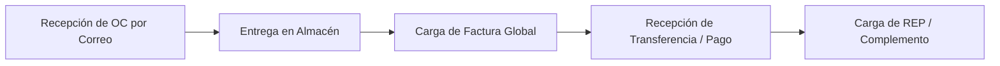

# 📘 Guía de Uso del Sistema para Proveedores y Equipo Operativo
**SaaS de Compras y Cuentas por Pagar (P2P)**  
*Grupo Industrial Nousars S.A. de C.V.*

---

## 🎯 Objetivo de la Herramienta
Esta plataforma automatiza y transparenta la relación comercial entre **Nousars** y sus **Proveedores**, agilizando desde la solicitud de cotización y emisión de la Orden de Compra, hasta la recepción de materiales, programación de pagos y validación fiscal de Facturas y Complementos de Pago (REP).

---

## 🧭 ¿Qué puede hacer el Proveedor en el Sistema?

El proveedor no necesita recordar contraseñas complejas ni instalar programas. Opera a través de **notificaciones por correo con enlaces directos seguros** y del **Portal de Autoservicio**:

### 1. Recepción Formal de la Orden de Compra (OC)
* **Cómo funciona:** Cuando compras adjudica una compra, el proveedor recibe un correo automático con:
  * El **Folio oficial de Orden de Compra** (ej. `OC-2026-001`).
  * El **ID de Trazabilidad** (`PR-XXXX`).
  * El desglose de partidas, precios unitarios, tiempos de entrega y condiciones de pago acordadas.
  * El **archivo PDF oficial adjunto**, listo para ser procesado por su área de producción o ventas.

---

### 2. Portal Seguro de Autoservicio para Facturación y Complementos (`portal.html`)
Para agilizar su pago sin correos perdidos, el proveedor cuenta con un **Portal Web Directo**:
* **Acceso con Referencia:** Mediante el enlace recibido en su comprobante de pago (ej. `portal.html?ref=PAG-XXXX`).
* **Carga de XML del CFDI (Obligatorio):** Permite subir el archivo `.xml` emitido ante el SAT.
* **Carga de PDF de Factura o REP (Opcional pero recomendado):** Para respaldo visual de contabilidad.
* **Validación en tiempo real:** El sistema vincula automáticamente el archivo con su expediente en Google Drive y actualiza el saldo en Google Sheets.

---

### 3. Notificación de Pagos y Abonos Parciales
* Cuando Finanzas realiza una transferencia:
  * El proveedor recibe la confirmación con el importe exacto abonado, fecha y referencia bancaria.
  * Se le indica claramente si el pago liquida la compra en su totalidad o si corresponde a una parcialidad (ej. *Parcialidad 1 de 3*).

---

### 4. ¿Cómo opera la solicitud de Complementos de Pago (REP)?
Para mantener una relación fluida y sin spam innecesario:
1. **Regla de No Hostigamiento:** El sistema **no envía correos diarios agresivos**.
2. **Plazo de Cortesía:** Tras recibir su transferencia, el proveedor dispone de varios días para que su departamento contable emita y cargue el XML del Complemento de Pago.
3. **Recordatorio Oportuno:** Únicamente si transcurren más de 4-5 días hábiles sin que se haya subido el comprobante, el sistema enviará un recordatorio amigable con el botón directo de subida.
4. **Cierre Automático:** En cuanto el proveedor sube el archivo `.xml` a través del portal, los avisos de esa parcialidad se cancelan de inmediato.

---

## 🛠️ Resumen de Funciones Actuales del Sistema

| Módulo / Función | ¿Quién lo usa? | Descripción |
| :--- | :---: | :--- |
| **P2P - Compras Automatizadas** | Compras / Admin | Ingesta y análisis de cotizaciones PDF, matriz comparativa inteligente, selección de proveedor ganador y generación de OC en PDF A4. |
| **Recepción en Almacén** | Almacén / Operaciones | Registro de entregas físicas (Completa o **Entrega Parcial** con alerta visual en el flujo). |
| **Módulo de Pagos y Parcialidades** | Finanzas / Contabilidad | Programación de abonos a capital, control de método de pago (PUE / PPD) y cálculo de saldos insolutos. |
| **Portal de CFDI / REP** | **Proveedor** | Pantalla simplificada para arrastrar XML y PDF del comprobante fiscal sin requerir login interno. |
| **Expedientes en Google Drive** | Compras / Auditoría | Cada orden y proveedor tiene su carpeta con links compartidos para consultar cotizaciones, OCs y facturas. |
| **Dashboard Financiero** | Dirección / Contabilidad | Indicadores clave: Monto total, saldo pendiente global, pagos próximos a 7 días y alertas de facturas faltantes. |

---

## 📋 Mensaje / Correo Sugerido para Enviar al Proveedor

Puedes copiar y compartir este texto a tus proveedores para darles la bienvenida al sistema:

> **Asunto:** Bienvenido a nuestra plataforma de compras y gestión de pagos - Grupo Industrial Nousars
>
> Estimado Proveedor,
>
> Con el propósito de optimizar nuestros tiempos de respuesta, recepción de materiales y programación de sus pagos, le informamos que hemos implementado un sistema automatizado de gestión de compras.
>
> **¿Qué beneficios tiene para ustedes?**
> 1. **Órdenes de Compra Claras:** Recibirán directamente en su correo la Orden de Compra formal en PDF con las especificaciones y precios pactados.
> 2. **Confirmación de Transferencias Inmediata:** Cada pago o abono realizado a su cuenta les enviará el comprobante bancario detallando la referencia y parcialidad.
> 3. **Portal Seguro para sus Facturas y Complementos:** Para evitar demoras en revisión de correos, recibirán un enlace directo donde podrán arrastrar el archivo XML/PDF de sus facturas o Complementos de Pago (REP) en segundos.
>
> Agradecemos su colaboración continua para mantener al día la carga de sus comprobantes fiscales y agilizar las liberaciones de sus próximos pagos.
>
> Atentamente,  
> **Departamento de Compras y Finanzas**  
> *Grupo Industrial Nousars S.A. de C.V.*
